# US Store: Sales and Performance Analysis 

## Introduction 

This is a data analysis project aimed at understanding some market dynamics of a particular store in the United States of America. With this analysis, business questions were answered and key performance indicators determined. 
**_Disclaimer_**: This project does not represent or affiliated with any institutions, countries or companies. 

## Business Questions

This analysis intends to answer the following questions: 
1.	What is the average revenue generated from the sales in each product category? 
2.	What is the total revenue generated from each segment? 
3.	What is the number of transactions generated from each segment? 
4.	What is the overall trend in revenue generated over time? 
5.	What is the average frequency of each customer’s visit? 
6.	What is the total profit generated from each state?

## Data Sourcing 

The dataset used for this analysis project was provided by my tutor to use. 

## Skills demonstrated
- Data cleaning
- Data transformation
- Use of pivot tables
- Data visualization
- Use of Excel functions
- Use of Slicers

## Data Transformation

The data was cleaned and then transformed by making sure that data in each column fits perfectly with the exact data type. Blanks and duplicates are also checked in order to avoid error in the analysis. 

## Analysis/Visualization 

#### What is the average revenue generated from the sales of each product category? 

The average revenue generated from the sales of each product category was analyzed using a pivot table and visualized with a column chart. The result is highlighted in the images below. 

Average Revenue by Category             |  Visualization Chart
:---------------------------------------| :---------------------------
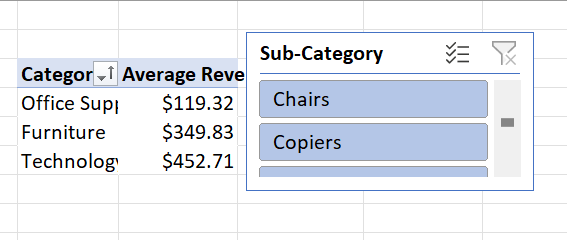       | 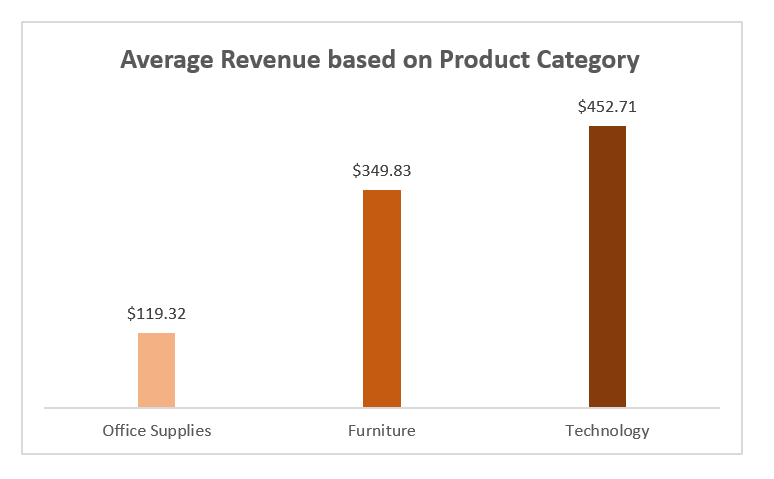

#### What is the total revenue generated from each segment? 

The total revenue generated from each segment was analyzed using a pivot table and visualized using  a bar chart. The result of this analysis is highlighted in the images below. 

Total Revenue by Segment           |   Visualization Chart
:------------------------------    | :---------------------------
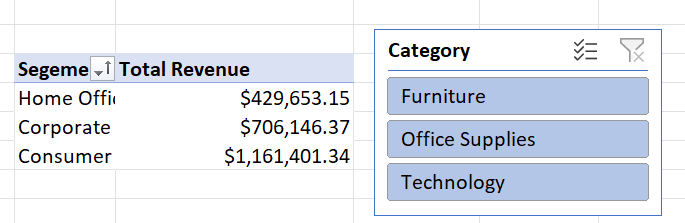     | 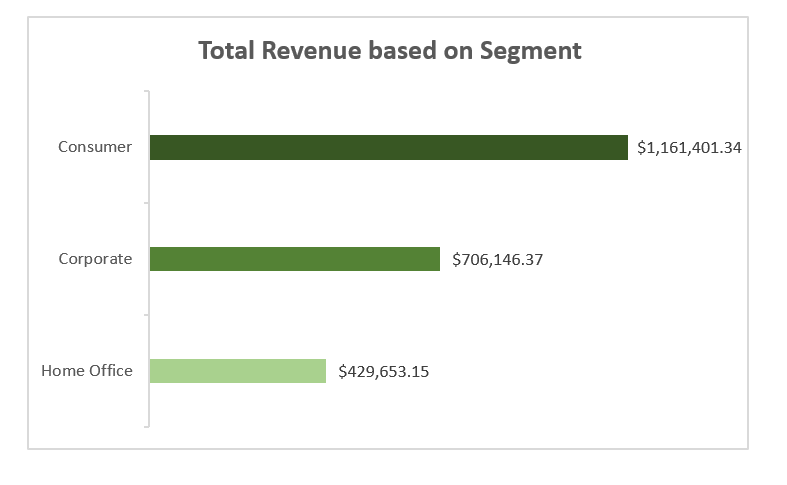

#### What is the number of transactions generated from each segment? 

The number of transactions generated from each segment was analyzed using a pivot table and visualized with a column chart. The result is highlighted in the image below. 

Transactions by Segment             |  Visualization Chart 
:---------------------------------- | :------------------------
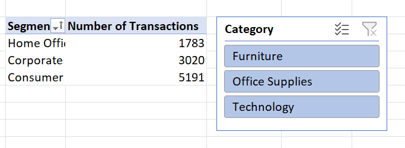        | 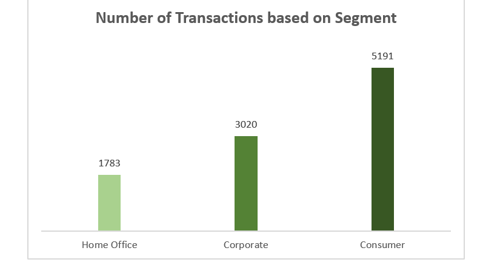

#### What is the overall trend in revenue over time?

The sales trend was analyzed by plotting year against the sales. The analysis is visualized with the aid of a line chart. The analysis showed a great increment in the revenues generated from 2014 to 2017.  The result is highlighted below. 

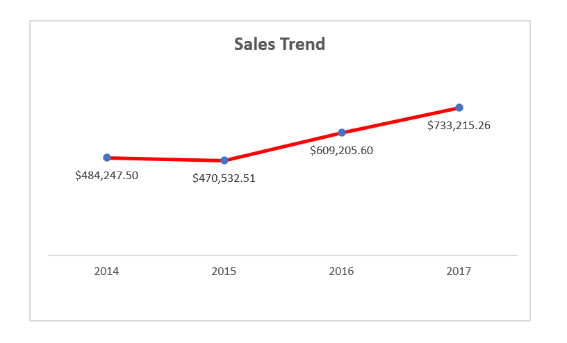

#### What is the number of transactions generated from each region? 

The number of transactions generated from each region was analyzed with a pivot table and visualized with the use of a column chart. The result is shown in the images below. 

Transactions by Region            |  Visualization Chart   
:-------------------------------  | :------------------------ 
       | 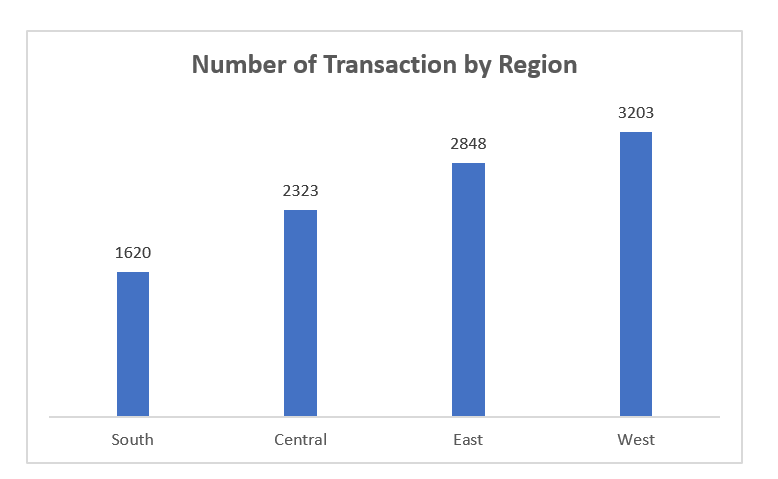

#### What is the total profit generated from each region?

The total profit generated in each region was analyzed using a pivot table and visualized with a bar chart. The result is shown below. 

Profit by Region              |     Visualization Chart
:--------------------------   | :--------------------------
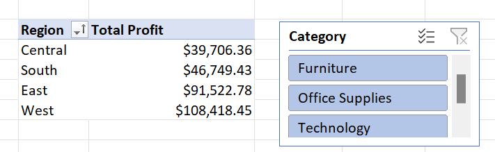        | 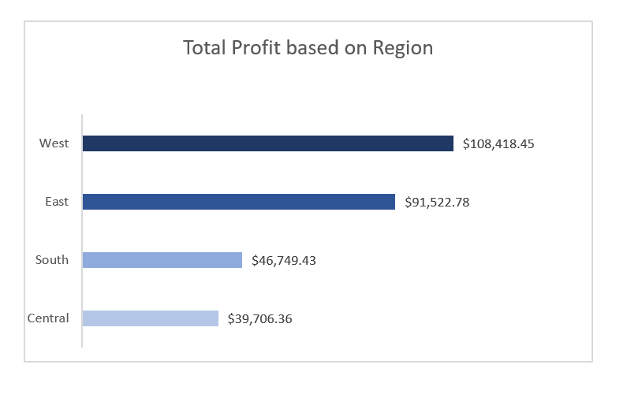

## Key Performance Indicators

For this analysis, the following key performance indicators are used to measure the performance of the store. 
1.	Total revenue 
2.	Profit margin
3.	Average transaction value
4.	Customer footfall

**Total Revenue:** This is the total income generated by the business over a period of time. This was calculated using the following formula in Excel: =SUM(R2:R9995). The R column in this dataset represents Sales. Total revenue is calculated by summing up the sales column. The result is highlighted in the image below.

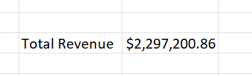 

**Profit margin:** Profit margin is a financial metric that represents the percentage of revenue a company retains as profit after all expenses are deducted. It is often calculated as: Profit Margin = (Total Profit / Total Revenue). The formula used is “=Y4/Y3” and the result formatted as percentage. Y4 is the total profit, while Y3 is the total revenue. The profit margin is 12% and it is highlighted in the image below. 

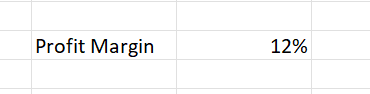

**Average transaction value:** This is the average amount spent by a customer in a single transaction. This is calculated by dividing the total revenue by total number of transactions. The formula used is “=Y3/Y5”, where Y3 represents the total revenue and Y5 represents the total number of transactions. The result of the analysis is shown below. 

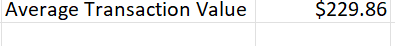

**Customer footfall:** This is the number of customers visiting the store. The formula used is “=COUNT(F2:F9995)”. The F column is the Customer ID column. The result is shown below. 

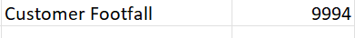

## Conclusion 

Our analysis of this Store sales data for the past years revealed a clear trend of revenue generated from each region, segment and category, with highest revenue generated from the West region, Consumer segment and Technology category. This analysis can help the store to make better and informed decisions based on their sales and upscale for the coming years. 
